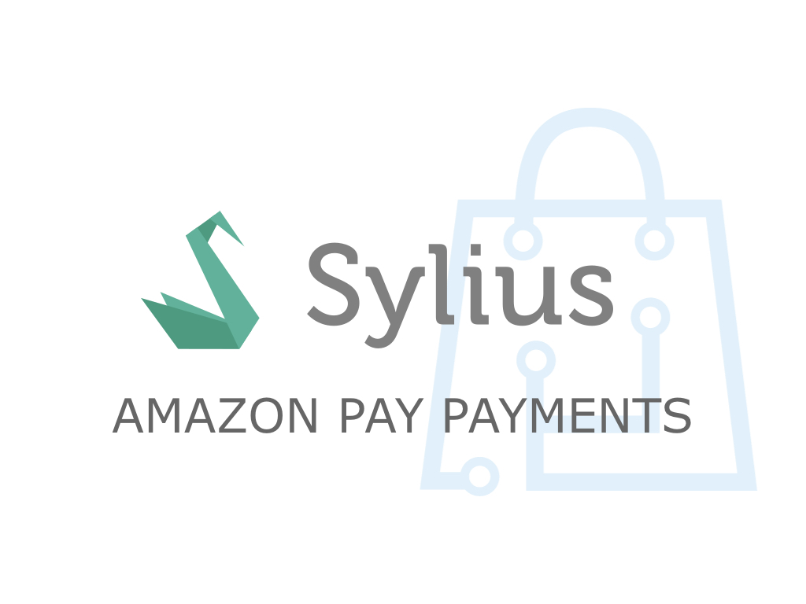

<h1 align="center">
    <a href="http://bitbag.shop" target="_blank">
        
    </a>
    <br />
    <a href="https://packagist.org/packages/bitbag/amazon-pay-plugin" title="License" target="_blank">
        
    </a>
    <a href="https://packagist.org/packages/bitbag/amazon-pay-plugin" title="Version" target="_blank">
        
    </a>
    <a href="http://travis-ci.org/BitBagCommerce/SyliusAmazonPayPlugin" title="Build status" target="_blank">
         
    </a>
    <a href="https://scrutinizer-ci.com/g/BitBagCommerce/SyliusAmazonPayPlugin/" title="Scrutinizer" target="_blank">
        
    </a>
    <a href="https://packagist.org/packages/bitbag/amazon-pay-plugin" title="Total Downloads" target="_blank">
        
    </a>
    <p>
        
    </p>
</h1>

## BitBag SyliusAmazonPayPlugin

This plugin allows you to integrate AmazonPay payment with Sylius platform app.

## Installation

1. Require plugin with composer:
   ```bash
    $ composer require bitbag/amazon-pay-plugin
   ```

2. Add plugin class to your bundles.php file:

     ```bash
        $bundles = [
            BitBag\SyliusAmazonPayPlugin\BitBagSyliusAmazonPayPlugin::class => ['all' => true],
        ];

     ```
3. Import routing on top of your config/routes.yaml file:
    ```yaml
    bitbag_sylius_amazon_pay_plugin:
        resource: "@BitBagSyliusAmazonPayPlugin/Resources/config/routing.yml"
        prefix: /
    ```
4. Add routing to sylius_shop.yml:
    ```yaml
    sylius_shop_checkout_start:
       path: /{_locale}/checkout-start
       methods: [GET]
       defaults:
           _controller: bitbag_sylius_amazon_pay_plugin.controller.action.checkout_start
       requirements:
           _locale: ^[a-z]{2}(?:_[A-Z]{2})?$  
   ```
5. Install assets:
   ```bash 
    bin/console assets:install --symlink
   ```
6. Clear cache:
   ```bash 
    bin/console cache:clear
   ```

## Change the order of steps in the checkout
 Add checkout resolver to _sylius.yml:

```yaml
sylius_shop:
    checkout_resolver:
       pattern: /checkout/.+
       route_map:
           empty_order:
               route: sylius_shop_cart_summary
           cart:
               route: sylius_shop_checkout_address
           addressed:
               route: sylius_shop_checkout_select_payment
           payment_selected:
               route: sylius_shop_checkout_select_shipping
           payment_skipped:
               route: sylius_shop_checkout_select_shipping
           shipping_selected:
               route: sylius_shop_checkout_complete
           shipping_skipped:
               route: sylius_shop_checkout_complet
```

Add state machine in _sylius.yml:

```yaml
winzou_state_machine:
    sylius_order_checkout:
       transitions:
           select_payment:
               from: [payment_selected, shipping_skipped, shipping_selected, addressed]
               to: payment_selected
           complete:
               from: [payment_selected, payment_skipped, shipping_selected, shipping_skipped]
               to: completed
```
## Cron job
Cron refreshes the status of AmazonPay

for example:

```bash
*/5 * * * * bin/console bitbag:amazon-pay:update-payment-state
```

## Fixtures
Example fixture configuration:
```yaml
sylius_fixtures:
    suites:
        default:
            fixtures:
                payment_method:
                    options:
                        custom:
                            amazon_pay:
                                code: "amazon_pay"
                                name: "Amazon pay"
                                channels:
                                    - "US_WEB"
                                enabled: true
                                gatewayFactory: amazonpay
                                gatewayName: Amazon pay
                                gatewayConfig:
                                    payum.http_client: '@bitbag.sylius_amazon_pay_plugin.amazon_pay_api_client'
                                    buttonColor: Gold
                                    buttonSize: Large
                                    buttonType: PwA
                                    buttonLanguage: de-DE
                                    environment: sandbox
                                    merchantId: "test" 
                                    accessKey: "test"
                                    secretKey: "test"
                                    clientId: "test"
                                    region: de
```

## Testing

```bash
$ composer install
$ cd tests/Application
$ yarn install
$ yarn run gulp
$ bin/console assets:install web -e test
$ bin/console doctrine:database:create -e test
$ bin/console doctrine:schema:create -e test
$ bin/console server:run 127.0.0.1:8080 -d web -e test
$ open http://localhost:8080
$ bin/behat
$ bin/phpspec run
```
