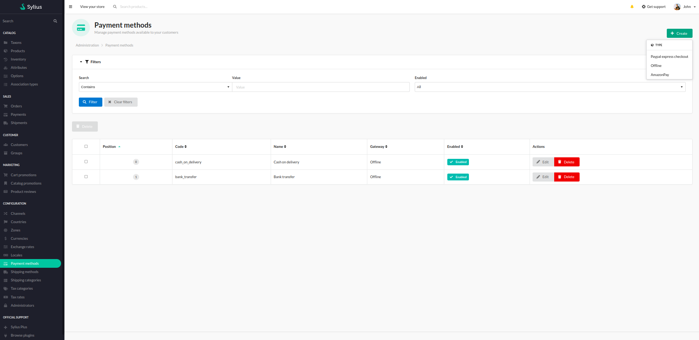
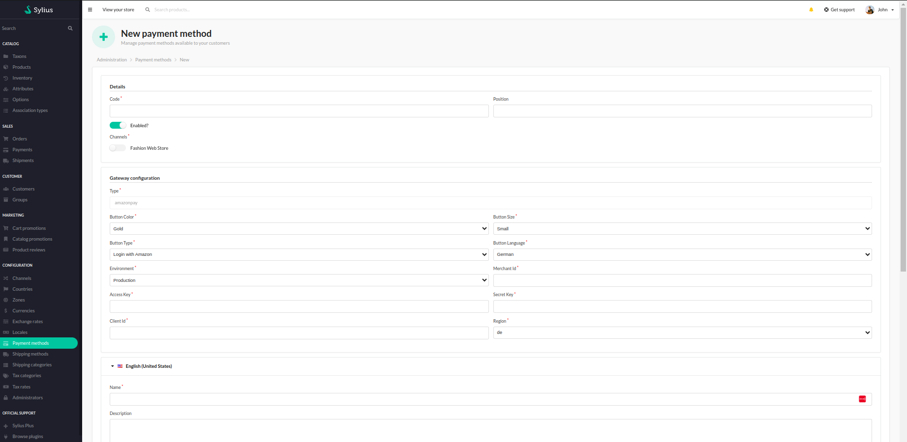
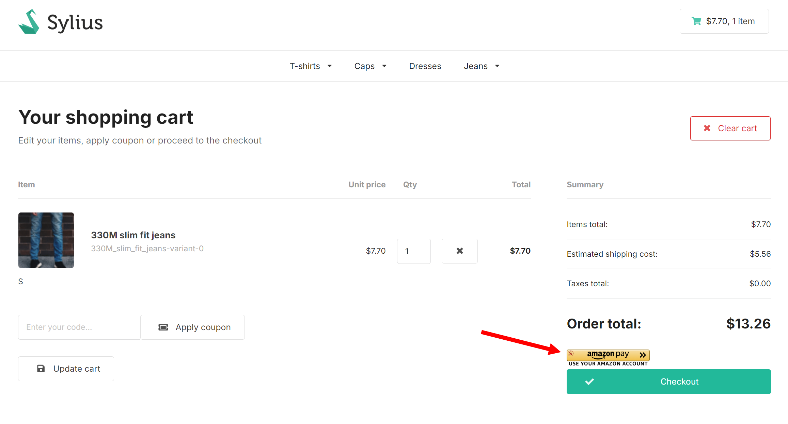

# Functionalities

---

The plugin integrates AmazonPay payments with Sylius based applications.

>[Amazon Pay](https://pay.amazon.com/how-it-works) is an online payment method offered by Amazon that allows users to use the payment information stored in their Amazon account to make purchases on other websites and apps.
This allows customers to enjoy secure and convenient transactions, and allows merchants to offer a trusted payment solution.

- After an installation, user should be able to create new AmazonPay payment method in the "Payment methods" section in the admin panel.

    

- Once there, user can fill out the configuartion form with all the needed info like configuration keys, id, type of the environment, code, name etc..

    

- After this, created payment method should be visible in the shopping cart.

    

